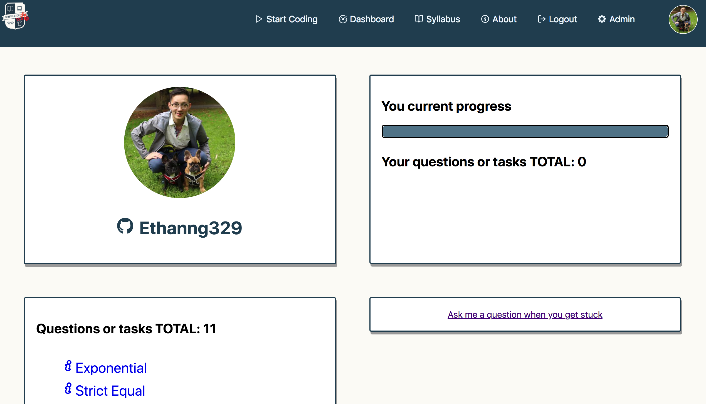

# Constructor Wars

## Technologies used:

- React with Redux
- Postgres Database
- Express server
- Github OAuth authorisation
- Monaco Editor
- iFrame for code evaluating with in sandbox enviroment

## Web Application for javascript code challenges.

Coding challenges designed for Constructor Labs students. Student can log in and practice on exercises tailored for the course to order to practice. This application features profile page to monitor learning progress, useful links for Constructor Labs syllabus for references, search field for more information on specific topic on MDN and monaco editor to run codes on broswer, and admin page to update the exercise database.

---

---

## Constructor Wars App is available soon as Rafal is back from Mexico.

---

Start the app in dev and watch mode `npm run go`

Run the jest test: `npm run test`

Build for deployment `npm run build`

---

## Team

Ethan - ([Twitter](https://twitter.com/Ethanng329)) - ([Github](https://github.com/ethan329))
James - ([Twitter](https://twitter.com/rb30)) - ([Github](https://github.com/jamesmcallister))
Jose - ([Twitter](https://twitter.com/_enpap)) - ([Github](https://github.com/0750kosse))
Julius ([Github](https://github.com/juliusvai))
Rafal - ([Github](https://github.com/Cantem))

## potential features and extension

- use pupeteer to run test on the whole application
- alternative log in methods
- higher test coverage
- explore graphQL?

## github-instructions

1.  Add and commit changes on working branch.
2.  `git checkout master` and then `git pull --rebase` on master branch.
3.  On working branch `git merge origin master`
4.  `git checkout <branchname>` - run `npm run dev` and check web app is working, might need to do `npm i`.
5.  If there is no conflicts - `git push --set-upstream origin <branchname>`.
6.  Merge it only Github (IMPORTANT: Only merge with papa James present.)
7.  Delete branches you are not working on from github and localy. `git branch -D <branchname>`

---

`npm run presentation` - this will build webpack in production, express server and run the presentation slides.

[Presentation Slides](http://127.0.0.1:8888)

[Presentation Site](http://127.0.0.1:8080)
