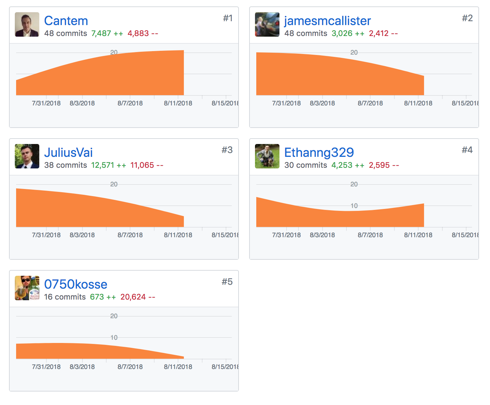
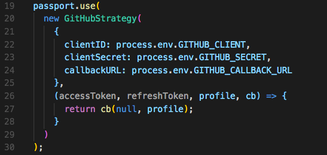
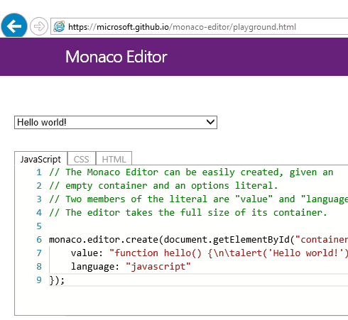
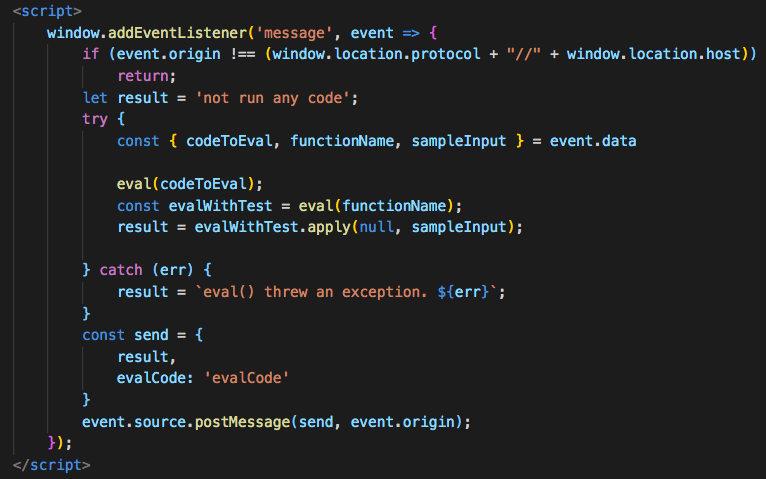
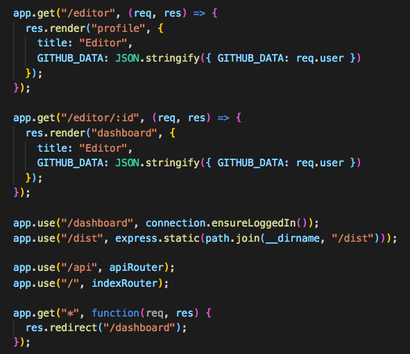
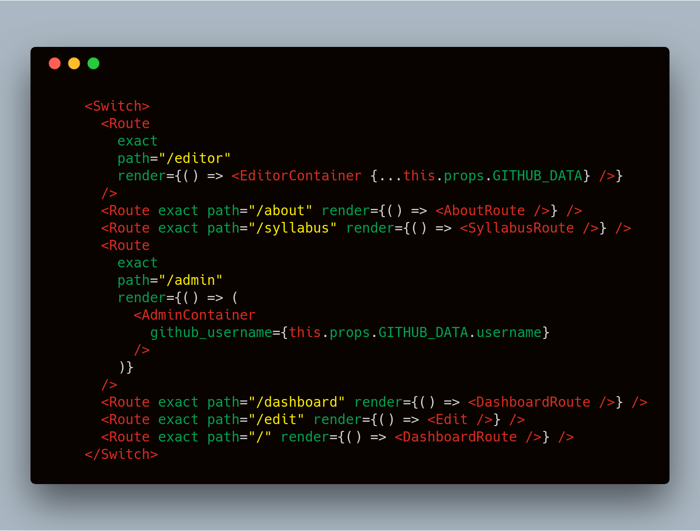
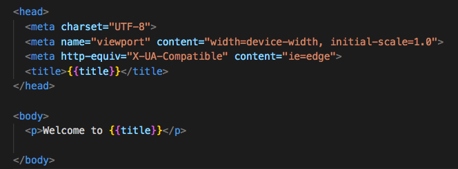

export { dark as theme } from 'mdx-deck/themes'

# CONSTRUCTOR WARS

Jose 
Rafal
Ethan
James
Julius

---

# SO FAR WE'VE DONE SO LITTLE

---

# GITHUB AUTHORISATION USING PASSPORT

---

# DATABASE - HEROKU POSTGRES

---

# MONACO EDITOR - VS CODE TO DISPLAY OUR CODE IN THE BROWSER

---

# IFRAME TO EXECUTE AND TEST THE CODE

---

# SNAPSHOT TESTS

---

# EXPRESS ROUTES

---

# REACT ROUTER

---

# HANDLEBARS

---

# REACT AND REDUX

---

# THANK YOU

---
