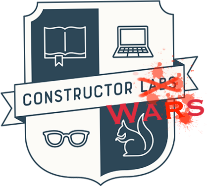

import { Notes } from 'mdx-deck'
import Small from './Small'

# If we had more time

<Notes>
  julius
1. Did have time for intergration tests - Db tests
2. List of question to complete before applying to constructor labs
3. Instructor wars - god level coding, timed
</Notes>

---

<Notes>

1. Why we joined.
2, What we enjoyed.
3, Where we are going.

</Notes>

---
import {FaReact} from 'react-icons/fa'

Thanks...

### 🇭🇰 Wán
### 󠁧󠁢󠁥󠁮󠁧󠁿🇬🇧 Finito
### 🇪🇸 TTFN
### 🇱🇹 Pabaiga
### 🇵🇱 Koniec

Thanks too....
#### This presentation was created in <FaReact /> React

#### Dmitri Image&copy from Team fun&copy and Hamzah&copy

#### Also Dmitri for this experience

<Notes>
 The prestenation your just watch was made in react.
</Notes>

---
import {GoLogoGithub} from 'react-icons/go'

Thanks for your continued patience during this time.

#### You can find our code at 

<GoLogoGithub size='3em'/>  

`https://github.com/constructor-wars`

