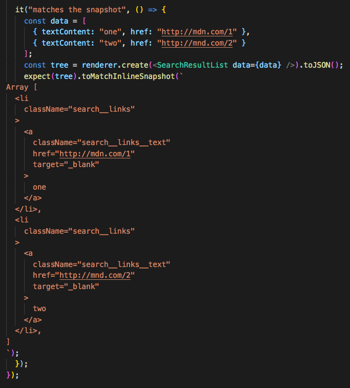

import { Notes } from 'mdx-deck'
import Small from './Small'

Julius

<Small name='Julius' quote=' @PapaJames,  prop...? what´s a prop...?, oh this.props'/>

<Notes>
    Julius
    Let introduce us
</Notes>

---

# TESTING

<Notes>
       julius
  Only visible in presenter mode
</Notes>

---