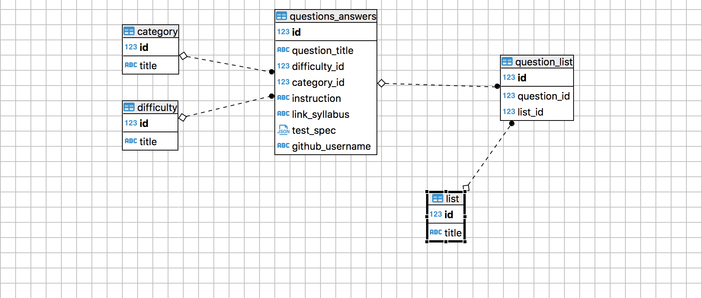

import { Notes } from 'mdx-deck'
import Small from './Small'

# Technology

- Express
- API routes
- GITHUB Auth
- Postgres DataBase 
- Heroku deployment

<Notes>
   Rafal
    login and log out routes


    why postgres

</Notes>

---
## Passport and GitHub authorisation
```jsx
passport.use(
  new GitHubStrategy(
    {
      clientID: process.env.GITHUB_CLIENT,
      clientSecret: process.env.GITHUB_SECRET,
      callbackURL: process.env.GITHUB_CALLBACK_URL
    },
    (accessToken, refreshToken, profile, cb) => {
      return cb(null, profile);
    }
  )
);
```

---

## Express Routes

``` 
const router = express.Router();

router.get("/questions", function(req, res) {
  getAllQuestions().then(data => res.json(data));
});

router.get("/question/:id", function(req, res) {
  const id = req.params.id;
  getQuestions(id).then(data => res.json(data));
});

router.post("/submitnewquestion", function(req, res) {
  const data = req.body;
  sumbitQuestionOnDatabase(data).then(data => res.json(data));
});
``` 
---

## Database sturcture



---


# Challenge 

- Login with github and
- Adding user to are DB
- Keeping them in sync

<Small name='james' quote='@ Rafal, dont copy and paste'/>

<Notes>
Login with github and
Adding user to are DB
Keeping them in sync
</Notes>

