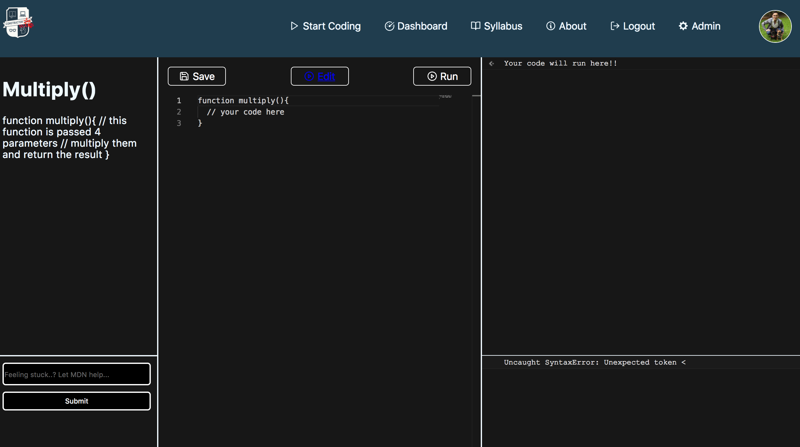

import { Notes } from 'mdx-deck'
import Small from './Small'

# Constructor wars

The app was designed to help constructor labs students practice coding.

<Notes>

</Notes>

---

# Meet the team

Jose 
Rafal
Ethan
Julius
James

<Notes>
introduction of each person
</Notes>
---

## PRESENTS....

---

<Notes>
Of each setion of the editor layout
</Notes>
---

Demo the site

<Notes>
0. dashboard
1. press run on broken add()
2. fix the code and show green
3. now safe this to your profile
4. demo mdn and syllobus still stuck ask dimi
6. click on admin.
</Notes>